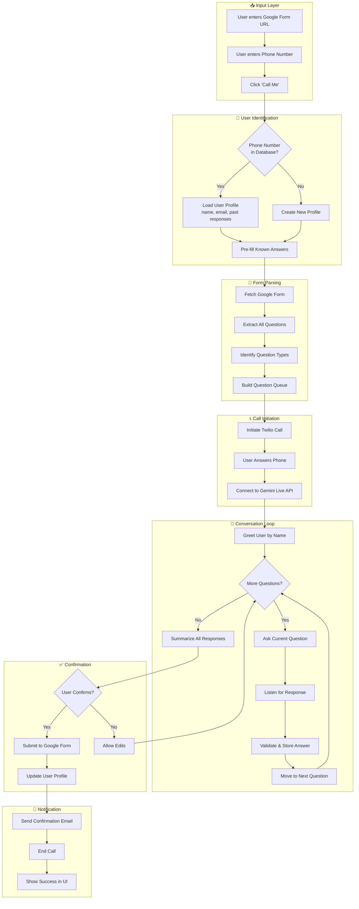
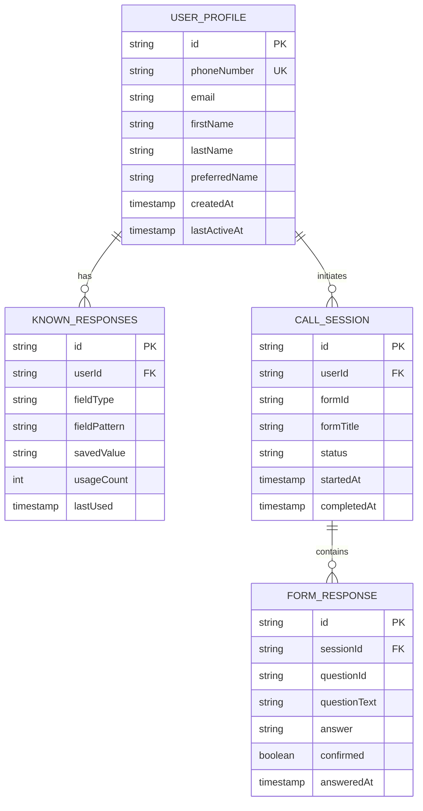
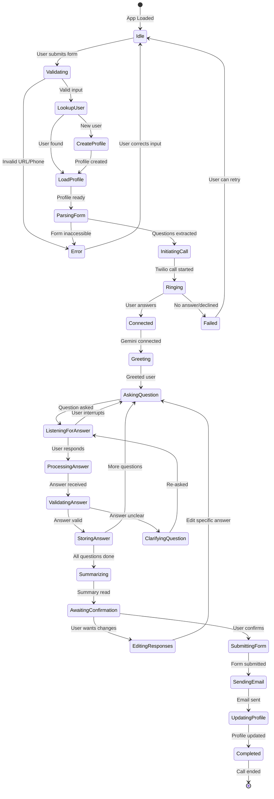
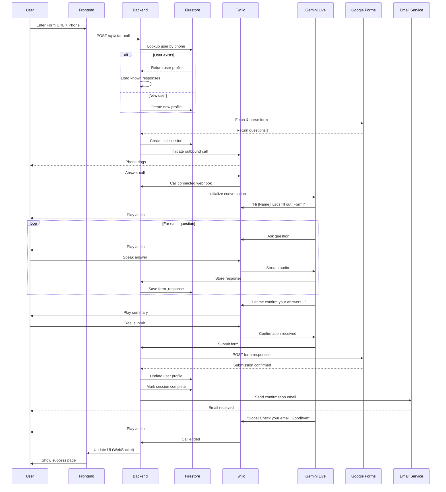

# Implementation Game Plan
## Cauliform - Technical Implementation Guide

**Stack:** Next.js + Google Cloud Run + Gemini Live API + Firebase

---

## Agent Pipeline Overview

The Cauliform agent follows a structured pipeline that manages user identification, form traversal, response collection, and submission confirmation.



---

## User Profile Data Model



---

## Detailed Agent State Machine



---

## Architecture Overview

```
┌─────────────────────────────────────────────────────────────────────────────┐
│                           FRONTEND (Next.js on Cloud Run)                    │
│  ┌─────────────────────────────────────────────────────────────────────┐    │
│  │  Landing Page          │  Call Status Page    │  Success Page       │    │
│  │  - Google Form URL     │  - "Calling you..."  │  - Confirmation     │    │
│  │  - Phone number        │  - Live transcript   │  - Email sent       │    │
│  │  - "Call Me" button    │  - Cancel option     │  - Form responses   │    │
│  └─────────────────────────────────────────────────────────────────────┘    │
└─────────────────────────────────────────────────────────────────────────────┘
                                      │
                                      ▼ API Routes
┌─────────────────────────────────────────────────────────────────────────────┐
│                         BACKEND (Next.js API Routes)                         │
│  ┌────────────┐  ┌────────────┐  ┌────────────┐  ┌────────────┐            │
│  │ /api/      │  │ /api/      │  │ /api/      │  │ /api/      │            │
│  │ parse-form │  │ start-call │  │ webhook    │  │ send-email │            │
│  └────────────┘  └────────────┘  └────────────┘  └────────────┘            │
└─────────────────────────────────────────────────────────────────────────────┘
                                      │
        ┌─────────────────────────────┼─────────────────────────────┐
        ▼                             ▼                             ▼
┌────────────────────┐  ┌──────────────────────────┐  ┌────────────────────┐
│   Firebase         │  │   Gemini Live API        │  │      Twilio        │
│   Firestore        │  │   (Voice AI Agent)       │  │   (Phone calls)    │
│   ─────────────    │  │   ─────────────────      │  │   ─────────────    │
│   • User Profiles  │  │   • Real-time STT        │  │   • Outbound calls │
│   • Known Answers  │  │   • Real-time TTS        │  │   • Audio stream   │
│   • Call Sessions  │  │   • Conversation State   │  │   • Webhooks       │
│   • Form Responses │  │   • Barge-in Support     │  │                    │
└────────────────────┘  └──────────────────────────┘  └────────────────────┘
                                      │
                                      ▼
                        ┌──────────────────────────┐
                        │   Google Forms API       │
                        │   ─────────────────      │
                        │   • Parse form structure │
                        │   • Submit responses     │
                        └──────────────────────────┘
                                      │
                                      ▼
                        ┌──────────────────────────┐
                        │   SendGrid / Gmail API   │
                        │   ─────────────────      │
                        │   • Confirmation emails  │
                        │   • Response summary     │
                        └──────────────────────────┘
```

---

## Call Flow Sequence Diagram



---

## User Profile System

### Profile Schema (Firestore)

```typescript
// src/lib/types.ts

interface UserProfile {
  id: string;
  phoneNumber: string;           // Primary identifier (E.164 format)
  email?: string;
  firstName?: string;
  lastName?: string;
  preferredName?: string;        // "Call me Alex"

  // Auto-learned responses
  knownResponses: {
    [fieldPattern: string]: {    // e.g., "email", "full_name", "company"
      value: string;
      usageCount: number;
      lastUsed: Date;
    };
  };

  // Statistics
  formsCompleted: number;
  totalCallMinutes: number;

  // Timestamps
  createdAt: Date;
  lastActiveAt: Date;
}

interface CallSession {
  id: string;
  userId: string;
  formId: string;
  formUrl: string;
  formTitle: string;

  status: 'pending' | 'calling' | 'in_progress' | 'confirming' |
          'submitted' | 'failed' | 'cancelled';

  currentQuestionIndex: number;
  responses: FormResponse[];

  twilioCallSid?: string;

  startedAt: Date;
  completedAt?: Date;
}

interface FormResponse {
  questionId: string;
  questionText: string;
  questionType: string;
  answer: string;
  confidence: number;           // Voice recognition confidence
  confirmedByUser: boolean;
  answeredAt: Date;
}
```

### User Lookup & Profile Loading

```typescript
// src/lib/user-profile.ts
import { db } from './firebase';
import { doc, getDoc, setDoc, updateDoc } from 'firebase/firestore';

export async function getOrCreateUserProfile(phoneNumber: string): Promise<UserProfile> {
  const normalizedPhone = normalizePhoneNumber(phoneNumber);
  const userRef = doc(db, 'users', normalizedPhone);
  const userSnap = await getDoc(userRef);

  if (userSnap.exists()) {
    // Update last active
    await updateDoc(userRef, { lastActiveAt: new Date() });
    return userSnap.data() as UserProfile;
  }

  // Create new profile
  const newProfile: UserProfile = {
    id: normalizedPhone,
    phoneNumber: normalizedPhone,
    knownResponses: {},
    formsCompleted: 0,
    totalCallMinutes: 0,
    createdAt: new Date(),
    lastActiveAt: new Date(),
  };

  await setDoc(userRef, newProfile);
  return newProfile;
}

export async function updateUserProfile(
  phoneNumber: string,
  responses: FormResponse[]
): Promise<void> {
  const userRef = doc(db, 'users', normalizePhoneNumber(phoneNumber));

  // Extract learnable fields
  const knownResponses: Record<string, any> = {};

  for (const response of responses) {
    const fieldType = identifyFieldType(response.questionText);
    if (fieldType) {
      knownResponses[`knownResponses.${fieldType}`] = {
        value: response.answer,
        usageCount: increment(1),
        lastUsed: new Date(),
      };
    }
  }

  await updateDoc(userRef, {
    ...knownResponses,
    formsCompleted: increment(1),
    lastActiveAt: new Date(),
  });
}

function identifyFieldType(questionText: string): string | null {
  const patterns: [RegExp, string][] = [
    [/email|e-mail/i, 'email'],
    [/full name|your name/i, 'fullName'],
    [/first name/i, 'firstName'],
    [/last name|surname/i, 'lastName'],
    [/phone|mobile|cell/i, 'phone'],
    [/company|organization|employer/i, 'company'],
    [/job title|position|role/i, 'jobTitle'],
    [/address|street/i, 'address'],
    [/city/i, 'city'],
    [/state|province/i, 'state'],
    [/zip|postal/i, 'zipCode'],
    [/country/i, 'country'],
  ];

  for (const [pattern, fieldType] of patterns) {
    if (pattern.test(questionText)) {
      return fieldType;
    }
  }
  return null;
}
```

---

## Gemini Agent Conversation Logic

```typescript
// src/lib/gemini-agent.ts

export function buildAgentSystemPrompt(
  userProfile: UserProfile,
  formTitle: string,
  questions: Question[]
): string {
  const userName = userProfile.preferredName || userProfile.firstName || 'there';

  const knownAnswersHint = Object.entries(userProfile.knownResponses)
    .map(([field, data]) => `- ${field}: "${data.value}"`)
    .join('\n');

  return `You are Cauli, a friendly and efficient voice assistant helping users fill out forms over the phone.

## USER CONTEXT
- Name: ${userName}
- Phone: ${userProfile.phoneNumber}
${userProfile.email ? `- Email: ${userProfile.email}` : ''}
- Forms completed previously: ${userProfile.formsCompleted}

## KNOWN INFORMATION (use to pre-fill or confirm)
${knownAnswersHint || '(No prior data)'}

## FORM TO COMPLETE
Title: "${formTitle}"

Questions:
${questions.map((q, i) => `${i + 1}. [${q.type}] ${q.title}${q.required ? ' (required)' : ''}`).join('\n')}

## CONVERSATION FLOW
1. GREETING: Start with "Hi ${userName}! I'm Cauli, and I'll help you fill out ${formTitle}. This should only take a couple minutes."

2. FOR EACH QUESTION:
   - If we have a known answer, say: "For [question], I have [known value] on file. Should I use that, or would you like to provide a different answer?"
   - If new question, ask clearly and wait for response
   - For multiple choice: Read ALL options clearly
   - Confirm unclear answers: "Just to confirm, you said [answer], is that right?"

3. SUMMARY: After all questions, read back ALL answers:
   "Great! Let me read back your responses:
   - [Question 1]: [Answer 1]
   - [Question 2]: [Answer 2]
   ...
   Does everything look correct? Say 'yes' to submit, or tell me what you'd like to change."

4. SUBMISSION: After confirmation:
   "Perfect! I'm submitting your form now... Done! You'll receive a confirmation email shortly. Thanks for using Cauliform, ${userName}. Have a great day!"

## VOICE STYLE
- Warm, professional, efficient
- Clear enunciation, natural pacing
- Handle interruptions gracefully (stop talking when user speaks)
- Keep responses concise - this is a phone call, not a chat`;
}
```

---

## Email Notification System

```typescript
// src/lib/email.ts
import { Resend } from 'resend';

const resend = new Resend(process.env.RESEND_API_KEY);

export async function sendConfirmationEmail(
  userEmail: string,
  formTitle: string,
  responses: FormResponse[],
  formUrl: string
): Promise<void> {
  const responseList = responses
    .map(r => `<tr>
      <td style="padding: 8px; border-bottom: 1px solid #eee;"><strong>${r.questionText}</strong></td>
      <td style="padding: 8px; border-bottom: 1px solid #eee;">${r.answer}</td>
    </tr>`)
    .join('');

  await resend.emails.send({
    from: 'Cauliform <noreply@cauliform.app>',
    to: userEmail,
    subject: `✅ Form Submitted: ${formTitle}`,
    html: `
      <div style="font-family: sans-serif; max-width: 600px; margin: 0 auto;">
        

        <h1 style="color: #333;">Form Submitted Successfully!</h1>

        <p>Hi there,</p>

        <p>Your responses to <strong>${formTitle}</strong> have been submitted successfully.</p>

        <h2 style="color: #666; font-size: 16px; margin-top: 30px;">Your Responses:</h2>

        <table style="width: 100%; border-collapse: collapse;">
          ${responseList}
        </table>

        <p style="margin-top: 30px; color: #666; font-size: 14px;">
          Original form: <a href="${formUrl}">${formUrl}</a>
        </p>

        <hr style="margin: 30px 0; border: none; border-top: 1px solid #eee;">

        <p style="color: #999; font-size: 12px;">
          This form was completed via Cauliform - voice-powered form filling.
          <br>
          <a href="https://cauliform.app">Learn more</a>
        </p>
      </div>
    `,
  });
}
```

---

## Phase Implementation Timeline

### Phase 1: Foundation (Days 1-2) ✅
- [x] Next.js project setup
- [x] Basic UI (landing page)
- [x] Environment configuration
- [x] Dockerfile for Cloud Run

### Phase 2: User Profile System (Days 3-4)
- [ ] Firebase Firestore setup
- [ ] User profile CRUD operations
- [ ] Phone number normalization
- [ ] Known responses storage

### Phase 3: Form Parsing & Call Flow (Days 5-6)
- [ ] Google Form parsing (scraping + API)
- [ ] Twilio integration
- [ ] Call session management
- [ ] WebSocket for UI updates

### Phase 4: Gemini Agent (Days 7-8)
- [ ] Gemini Live API integration
- [ ] Agent system prompt
- [ ] Question traversal logic
- [ ] Response validation
- [ ] Confirmation flow

### Phase 5: Submission & Notifications (Days 9-10)
- [ ] Google Form submission
- [ ] Email confirmation (Resend/SendGrid)
- [ ] Profile learning & updates
- [ ] Error handling

### Phase 6: Polish & Demo (Days 11)
- [ ] Deploy to Cloud Run
- [ ] End-to-end testing
- [ ] Demo video recording
- [ ] Devpost submission

---

## Key Files to Implement

| Priority | File | Purpose |
|----------|------|---------|
| 1 | `src/lib/user-profile.ts` | User profile CRUD, phone lookup |
| 2 | `src/lib/session.ts` | Call session management |
| 3 | `src/lib/gemini-agent.ts` | Conversation logic & prompts |
| 4 | `src/lib/form-parser.ts` | Google Form extraction |
| 5 | `src/lib/email.ts` | Confirmation emails |
| 6 | `src/app/api/start-call/route.ts` | Call initiation endpoint |
| 7 | `src/app/api/webhook/route.ts` | Twilio webhook handler |
| 8 | `src/app/api/submit-form/route.ts` | Form submission |

---

## Environment Variables

```env
# Google AI (Gemini)
GOOGLE_AI_API_KEY=your_gemini_api_key
GOOGLE_CLOUD_PROJECT=your_project_id

# Twilio Voice
TWILIO_ACCOUNT_SID=your_twilio_account_sid
TWILIO_AUTH_TOKEN=your_twilio_auth_token
TWILIO_PHONE_NUMBER=+1234567890

# Firebase
NEXT_PUBLIC_FIREBASE_API_KEY=your_firebase_api_key
NEXT_PUBLIC_FIREBASE_AUTH_DOMAIN=your_project.firebaseapp.com
NEXT_PUBLIC_FIREBASE_PROJECT_ID=your_project_id
FIREBASE_SERVICE_ACCOUNT_KEY={"type":"service_account",...}

# Email (Resend)
RESEND_API_KEY=re_xxxxx

# App Configuration
NEXT_PUBLIC_APP_URL=https://cauliform.run.app
```

---

*Last updated: March 5, 2026*
