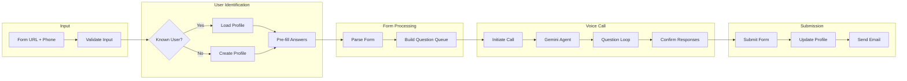
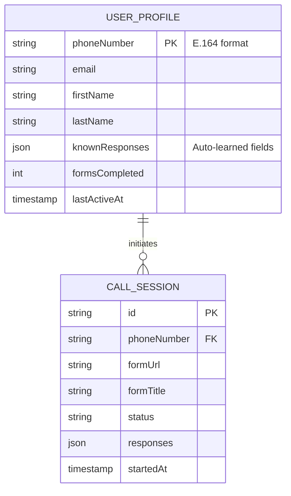
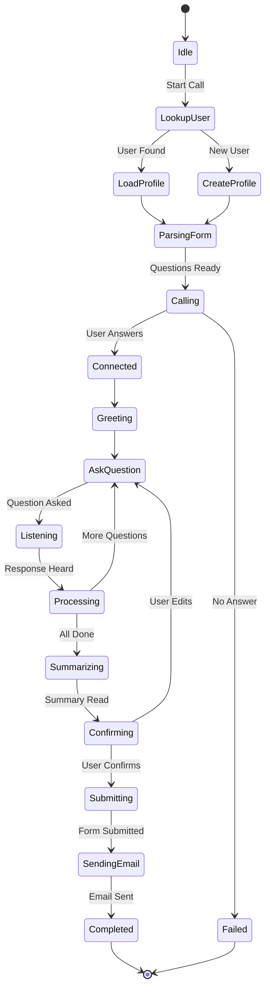
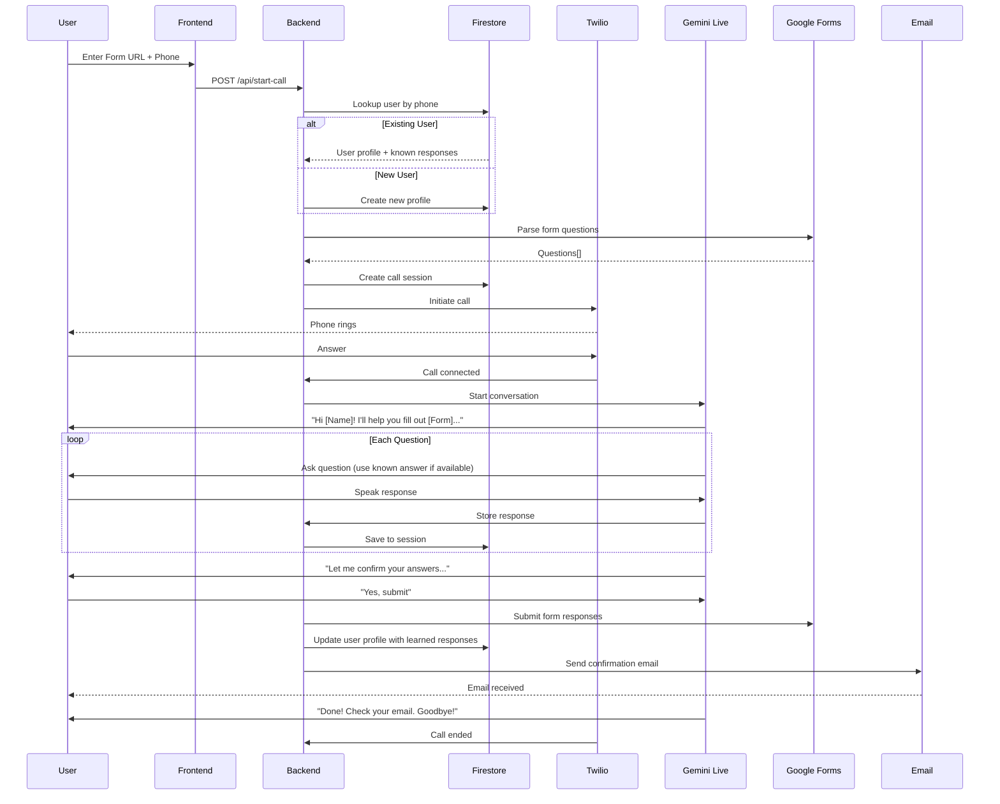

# Product Requirements Document (PRD)
## Cauliform - Voice-Powered Google Form Agent

**Version:** 1.0
**Last Updated:** March 5, 2026
**Hackathon Deadline:** March 16, 2026 @ 5:00pm PDT
**Category:** Live Agents

---

## 1. Executive Summary

Cauliform is an AI-powered voice agent that converts Google Forms into phone call experiences. Users paste a Google Form link, receive an automated call, and complete the form conversationally while hands-free.

**Target Hackathon Prize:** Best of Live Agents ($10,000) or Grand Prize ($25,000)

---

## 2. Problem Statement

### The Pain Point
- Google Forms require full visual attention and manual typing
- Users abandon forms when busy, commuting, or multitasking
- Accessibility barriers for users with visual/motor impairments
- No voice-first option exists within the Google ecosystem

### Market Opportunity
- Millions of Google Forms created daily
- Growing demand for voice interfaces (smart speakers, voice assistants)
- Accessibility compliance becoming mandatory for organizations

---

## 3. Goals & Success Metrics

### Primary Goals
1. Demonstrate real-time voice interaction using Gemini Live API
2. Successfully parse and submit Google Forms via phone call
3. Create a seamless, interruptible conversation experience

### Success Metrics (Demo Day)
| Metric | Target |
|--------|--------|
| Form completion rate | 100% for demo forms |
| Average call duration | < 2 min for 5-question form |
| Voice recognition accuracy | > 95% |
| Interruption handling | Graceful mid-sentence stops |

---

## 4. User Personas

### Persona 1: Busy Professional (Primary)
- **Name:** Sarah, 32, Marketing Manager
- **Context:** Fills forms during commute, between meetings
- **Pain:** "I see a form notification but I'm driving—I'll do it later" (never does)
- **Goal:** Complete forms without stopping current activity

### Persona 2: Accessibility User
- **Name:** Marcus, 45, Software Engineer (low vision)
- **Context:** Screen readers work but are tedious for forms
- **Pain:** "Form layouts break my screen reader flow"
- **Goal:** Natural voice conversation instead of navigating UI

### Persona 3: Student
- **Name:** Alex, 20, College Student
- **Context:** Constant event registrations, course surveys
- **Pain:** "I have 5 forms to fill out and I'm walking to class"
- **Goal:** Batch complete forms while moving

---

## 5. User Stories & Requirements

### Must Have (MVP for Hackathon)

| ID | User Story | Acceptance Criteria |
|----|------------|---------------------|
| US-1 | As a user, I can paste a Google Form link and receive a phone call | Form URL validated, call initiated within 30 seconds |
| US-2 | As a user, I can answer form questions verbally | Speech-to-text captures responses accurately |
| US-3 | As a user, I can hear all form questions read aloud | Text-to-speech reads questions naturally |
| US-4 | As a user, I can interrupt the AI mid-question | Gemini Live API handles barge-in gracefully |
| US-5 | As a user, I hear a confirmation before submission | AI summarizes responses and asks for confirmation |
| US-6 | As a user, my form is submitted automatically | Google Form receives all responses correctly |

### Should Have (If Time Permits)

| ID | User Story | Acceptance Criteria |
|----|------------|---------------------|
| US-7 | As a user, I can save my profile (name, email) | Common fields auto-filled on future forms |
| US-8 | As a user, I can handle multiple choice questions | AI reads options, accepts "option 1" or actual text |
| US-9 | As a user, I get a text/email confirmation | Summary sent after submission |

### Nice to Have (Post-Hackathon)

| ID | User Story |
|----|------------|
| US-10 | PWA with share sheet integration |
| US-11 | Attachment handling via text/email |
| US-12 | Multi-language support |

---

## 6. Technical Requirements

### Mandatory (Hackathon Rules)
- [x] Use Gemini model (Gemini Live API)
- [x] Use Google GenAI SDK or ADK
- [x] Host backend on Google Cloud
- [x] Real-time audio interaction

### Technology Stack

```
┌─────────────────────────────────────────────────────────────┐
│                      FRONTEND (PWA)                         │
│  - Next.js / React                                          │
│  - Simple form: URL input + phone number                    │
│  - Deployed on: Vercel or Cloud Run                         │
└─────────────────────────────────────────────────────────────┘
                            │
                            ▼
┌─────────────────────────────────────────────────────────────┐
│                    BACKEND (Python)                         │
│  - FastAPI or Flask                                         │
│  - Deployed on: Google Cloud Run                            │
│                                                             │
│  Endpoints:                                                 │
│  - POST /api/start-call  (receives form URL + phone)        │
│  - POST /api/twilio-webhook (handles call events)           │
│  - POST /api/submit-form (submits to Google Forms)          │
└─────────────────────────────────────────────────────────────┘
                            │
              ┌─────────────┼─────────────┐
              ▼             ▼             ▼
┌───────────────────┐ ┌───────────┐ ┌─────────────────┐
│   Twilio Voice    │ │  Gemini   │ │  Google Forms   │
│   - Make calls    │ │  Live API │ │  - Parse form   │
│   - Stream audio  │ │  - STT    │ │  - Submit resp  │
│                   │ │  - TTS    │ │                 │
│                   │ │  - LLM    │ │                 │
└───────────────────┘ └───────────┘ └─────────────────┘
```

### API Dependencies

| Service | Purpose | Documentation |
|---------|---------|---------------|
| Gemini Live API | Real-time voice AI | [Google AI Studio](https://aistudio.google.com) |
| Twilio Voice | Phone calls | [Twilio Docs](https://www.twilio.com/docs/voice) |
| Google Forms API | Parse form structure | [Forms API](https://developers.google.com/forms/api) |
| Firebase Firestore | User profiles & sessions | [Firestore Docs](https://firebase.google.com/docs/firestore) |
| Resend/SendGrid | Confirmation emails | [Resend Docs](https://resend.com/docs) |

---

## 7. Agent Pipeline

The Cauliform agent follows a structured pipeline that manages user identification, form traversal, response collection, and submission confirmation.

### 7.1 High-Level Pipeline Flow



### 7.2 User Profile System

Phone number serves as the primary user identifier. The system learns and remembers common responses across forms.



**Known Response Fields (Auto-Learned):**
- `email` - Email address
- `fullName` - Full name
- `firstName` / `lastName` - Name parts
- `phone` - Phone number
- `company` - Organization name
- `jobTitle` - Position/role
- `address`, `city`, `state`, `zipCode`, `country` - Location info

### 7.3 Conversation State Machine



### 7.4 Detailed Call Flow



### 7.5 Email Confirmation

After successful form submission, users receive an email containing:
- Form title
- All questions and their submitted answers
- Link to original form
- Timestamp of submission

---

## 8. System Architecture

### Call Flow Sequence

```
User                    Frontend          Backend           Twilio          Gemini
 │                         │                 │                │               │
 │─── Paste Form URL ─────▶│                 │                │               │
 │─── Enter Phone # ──────▶│                 │                │               │
 │                         │── POST /start ─▶│                │               │
 │                         │                 │── Parse Form ─▶│               │
 │                         │                 │◀── Questions ──│               │
 │                         │                 │── Init Call ──▶│               │
 │◀─────────────────────── Phone Rings ──────│◀───────────────│               │
 │─── Answer Call ────────▶│                 │◀── Connected ──│               │
 │                         │                 │── Start Session ──────────────▶│
 │◀──────────────────── "Hi! Let's fill out this form..." ────────────────────│
 │                         │                 │                │               │
 │─── "My name is John" ──▶│                 │── Audio Stream ───────────────▶│
 │                         │                 │◀── Response + Next Q ──────────│
 │◀──────────────────── "Got it, John. Next question..." ─────────────────────│
 │                         │                 │                │               │
 │         ... (repeat for all questions) ...                 │               │
 │                         │                 │                │               │
 │◀──────────────────── "Let me confirm: Name: John..." ──────────────────────│
 │─── "Yes, submit" ──────▶│                 │                │               │
 │                         │                 │── Submit Form ▶│               │
 │◀──────────────────── "Done! Form submitted. Goodbye!" ─────────────────────│
 │                         │                 │── End Call ───▶│               │
```

---

## 8. Implementation Game Plan

### Phase 1: Foundation (Days 1-2)
**Goal:** Get basic infrastructure working

| Task | Owner | Est. Hours |
|------|-------|------------|
| Set up Google Cloud project | All | 1 |
| Create Python backend (FastAPI) | Chinat | 2 |
| Set up Twilio account + phone number | Preston | 1 |
| Basic frontend (URL + phone input) | Preston | 2 |
| Test Gemini Live API standalone | Chinat | 2 |
| **Milestone:** Make a test call that says "Hello" | | |

### Phase 2: Core Integration (Days 3-5)
**Goal:** Connect all the pieces

| Task | Owner | Est. Hours |
|------|-------|------------|
| Google Forms API - parse form structure | Chinat | 3 |
| Twilio + Gemini audio streaming | Chinat | 4 |
| Build conversation flow (question → answer → next) | Chinat | 3 |
| Handle multiple choice / checkbox questions | Preston | 2 |
| Confirmation flow before submission | Preston | 2 |
| Google Forms API - submit responses | Chinat | 2 |
| **Milestone:** Complete a real form via phone call | | |

### Phase 3: Polish & Edge Cases (Days 6-8)
**Goal:** Make it demo-ready

| Task | Owner | Est. Hours |
|------|-------|------------|
| Handle interruptions (barge-in) | Chinat | 2 |
| Error handling (invalid URLs, failed calls) | Preston | 2 |
| Improve voice persona / conversation flow | Chinat | 2 |
| UI polish (loading states, success/error) | Preston | 2 |
| User profile storage (Firestore) - optional | Preston | 3 |
| **Milestone:** Smooth demo with no crashes | | |

### Phase 4: Demo & Submission (Days 9-11)
**Goal:** Create winning submission

| Task | Owner | Est. Hours |
|------|-------|------------|
| Deploy to Google Cloud Run | Chinat | 2 |
| Record demo video (< 4 min) | All | 4 |
| Create architecture diagram | Chinat | 1 |
| Record GCP deployment proof | Chinat | 1 |
| Write Devpost submission | Chinat | 2 |
| Street interviews / user testimonials | All | 3 |
| Final testing + bug fixes | All | 2 |
| **Milestone:** Submit before deadline | | |

---

## 9. Risk Assessment

| Risk | Likelihood | Impact | Mitigation |
|------|------------|--------|------------|
| Gemini Live API latency issues | Medium | High | Test early, have fallback to standard API |
| Twilio + Gemini audio sync issues | Medium | High | Use WebSocket streaming, test extensively |
| Google Forms API rate limits | Low | Medium | Cache form structure, batch requests |
| Voice recognition errors | Medium | Medium | Add confirmation step, spell-out option |
| Time crunch | High | High | Prioritize MVP, cut nice-to-haves early |

---

## 10. Deliverables Checklist

### Required for Submission
- [ ] Working demo (form → call → submission)
- [ ] Public GitHub repository
- [ ] README with setup instructions
- [ ] Demo video (< 4 minutes)
- [ ] Architecture diagram
- [ ] Google Cloud deployment proof
- [ ] Devpost project page

### Bonus Points
- [ ] Blog post / content about building with Gemini
- [ ] Infrastructure-as-code (Terraform/Pulumi)
- [ ] Google Developer Group profile link

---

## 11. Daily Standup Schedule

**Time:** 9 PM (check-ins every two days per team agreement)

**Format:**
1. What did you complete?
2. What are you working on next?
3. Any blockers?

---

## 12. Resources

### Agentic Design Patterns (Must Watch/Read)
- [Agentic Pattern Lab](https://goo.gle/agenticpattern) - Hands-on code patterns
- [Multi-Agent Pattern Blog](https://goo.gle/multiagentpattern) - Multi-agent architectures
- [Design Agentic Patterns](https://goo.gle/agenticpatterndesign) - Design principles
- [ADK Agent Architectures (YouTube)](https://www.youtube.com/watch?v=GDm_uH6VxPY) - Part 1: Code walkthroughs and live demos for foundational AI agent architectures using ADK

### Documentation
- [Gemini Live API Guide](https://ai.google.dev/gemini-api/docs/live)
- [Google GenAI SDK (Python)](https://github.com/google/generative-ai-python)
- [Agent Development Kit (ADK)](https://github.com/google/adk-python)
- [Twilio Voice Quickstart](https://www.twilio.com/docs/voice/quickstart/python)
- [Google Forms API](https://developers.google.com/forms/api/guides)
- [Cloud Run Deployment](https://cloud.google.com/run/docs/quickstarts)

### Hackathon Resources
- [Gemini Live Agent Challenge - Devpost](https://devpost.com)
- [Google Cloud Credits Form](https://forms.gle/...) - Apply by March 13

---

## Appendix A: Sample Conversation Script

```
AI: Hi! I'm Cauli, your form-filling assistant. I'll help you complete
    the "TreeHacks 2026 Registration" form. Ready to get started?

User: Yeah, let's do it.

AI: Great! First question: What's your full name?

User: John Smith

AI: Got it, John Smith. Next: What's your email address?

User: john@stanford.edu

AI: john@stanford.edu, perfect. Are you currently a student?
    Your options are: Yes, No, or Recently graduated.

User: Yes

AI: Noted. What's your major or field of study?

User: Computer Science

AI: Computer Science, excellent. Last question: Why do you want to
    attend TreeHacks? This is a longer response, so take your time.

User: I want to build something cool with AI and meet other hackers.
      I've been working on voice interfaces and this seems like
      a great opportunity to push my skills.

AI: That sounds great! Let me read back your responses:
    - Name: John Smith
    - Email: john@stanford.edu
    - Student: Yes
    - Major: Computer Science
    - Why attend: "I want to build something cool with AI and meet
      other hackers. I've been working on voice interfaces and this
      seems like a great opportunity to push my skills."

    Should I submit this form?

User: Yes, submit it.

AI: Done! Your form has been submitted successfully. You should
    receive a confirmation email shortly. Thanks for using Cauli!
    Goodbye!

[Call ends]
```

---

*Document prepared for Gemini Live Agent Challenge 2026*
